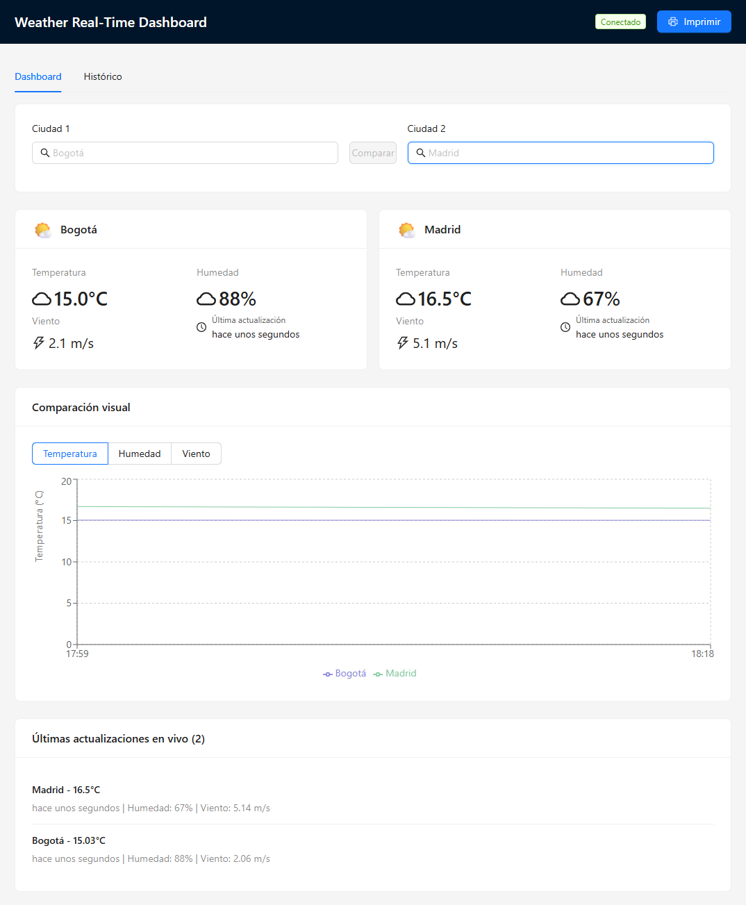
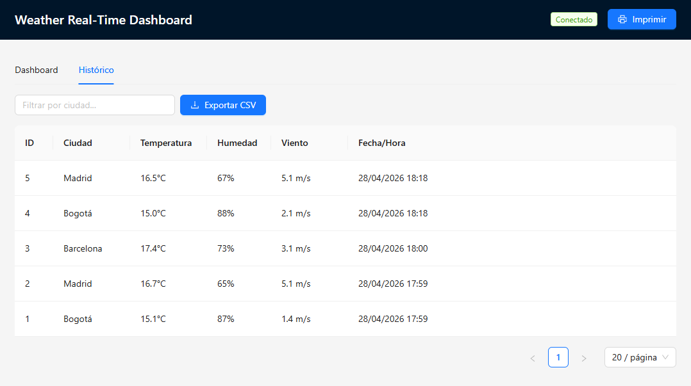
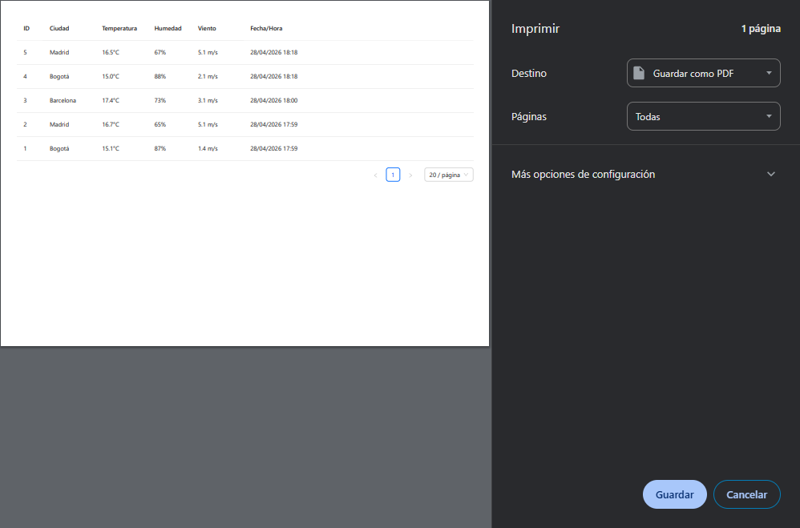
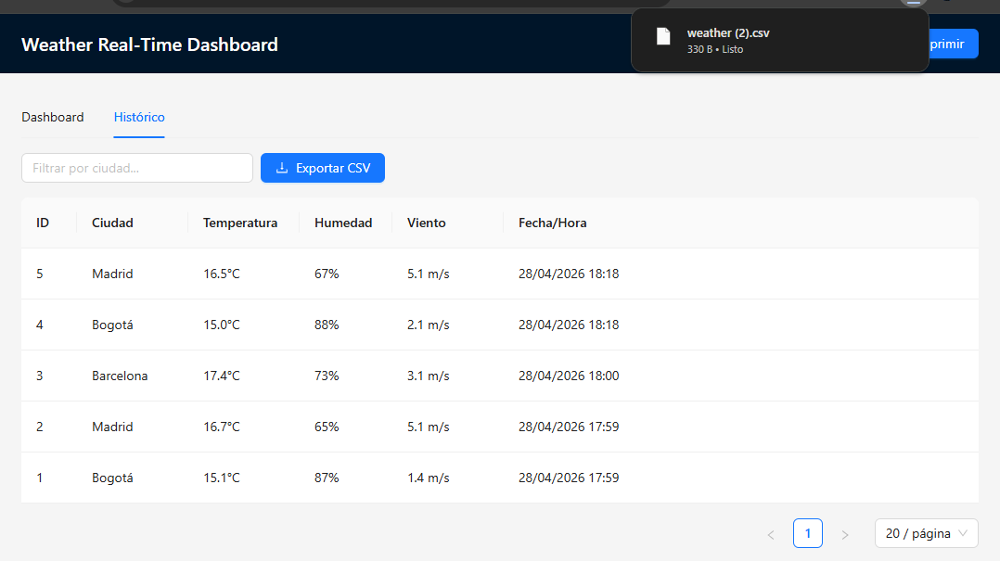
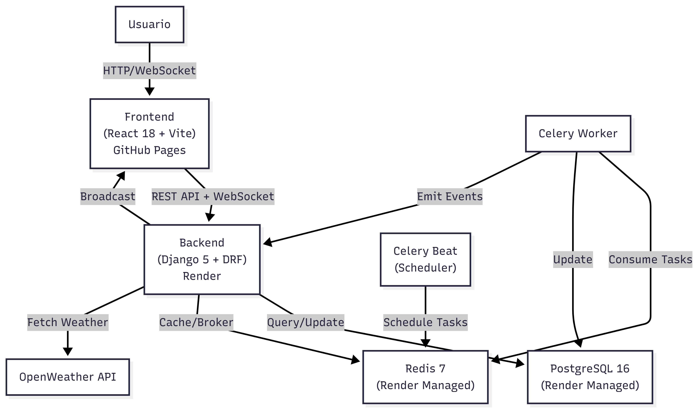
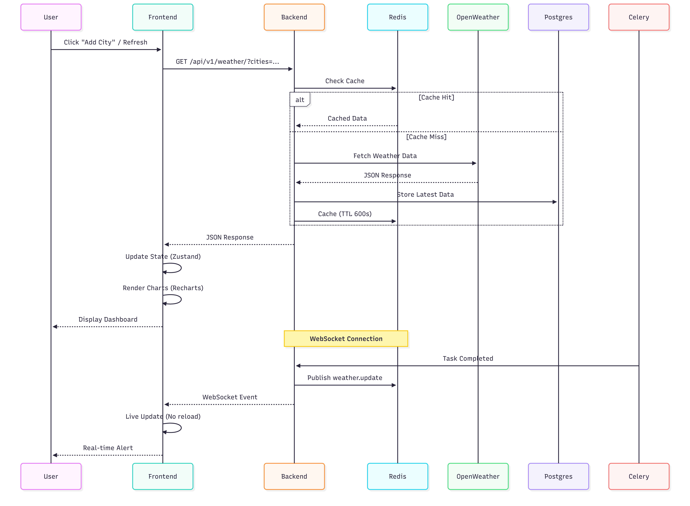
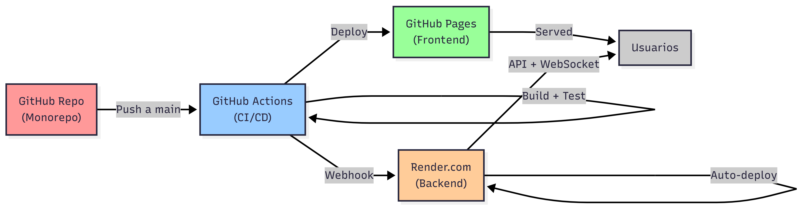

# Weather Real-Time Dashboard

[](https://github.com/kamt1128/weather-dashboard/actions)
[](LICENSE)
[](https://www.python.org/)
[](https://nodejs.org/)

## Descripcion

Dashboard de clima en tiempo real que consume la API OpenWeather para múltiples ciudades. Ofrece visualización de datos actuales y históricos, modo offline con IndexedDB, exportación CSV, y actualizaciones en vivo mediante WebSocket. Construido con las tecnologías más modernas para Full Stack Advanced: Django 5, React 18, TypeScript, y Celery para tareas en background.

**Características principales:**
- Búsqueda y monitoreo de múltiples ciudades simultáneamente
- Gráficos interactivos (temperatura, humedad, presión)
- Sincronización en tiempo real vía WebSocket
- Modo offline con datos locales (IndexedDB/Dexie)
- Exportación de datos históricos a CSV
- Cache Redis (TTL 600s) para reducir llamadas a API
- Tareas asincrónicas con Celery (actualización cada 10 min)
- Seguridad CORS configurada para producción

## Demo / Capturas

### 1. Dashboard tab
**Descripción**: Pantalla principal del dashboard recién abierto.



### 2. Histórico tab
**Descripción**: Pantalla que muestra una tabla con el histórico de comparaciones.



### 3. Impresion de datos
**Descripción**: Momento en que se le da click en la opción de imprimir.



### 4. Exportación de datos en archivo csv
**Descripción**: Momento de descargar el CSV o archivo descargado.



## URLs Públicas

| Recurso | URL |
|---------|-----|
| Frontend | `https://kamt1128.github.io/weather-dashboard` |
| Backend API | `https://weather-backend-grc8.onrender.com/api/v1` |
| Videos Demo | `https://drive.google.com/drive/folders/1-33q303dy-FelaojFYT5YSLI9zTDUVph?usp=sharing` |

## Arquitectura

## Diagrama de Componentes
Visualiza cómo los componentes principales del sistema interactúan entre sí:



## Diagrama de Secuencia
Muestra el flujo de una solicitud de clima desde el usuario hasta la visualización:



## Diagrama de Despliegue
Muestra cómo el código se propaga desde el repositorio hasta los usuarios:



**Resumen:**
- **Frontend:** GitHub Pages (SPA React + Vite)
- **Backend:** Render.com (Django + Daphne ASGI)
- **Base de Datos:** PostgreSQL 16 managed en Render
- **Cache:** Redis 7 managed en Render
- **Tareas:** Celery worker + beat (scheduler)
- **API Externa:** OpenWeather (free tier)

## Stack Tecnológico

| Capa | Tecnología | Version |
|------|-----------|---------|
| **Backend** | Django | 5.0.6 |
| | Django REST Framework | 3.14.0 |
| | Channels + Daphne | 4.1.0 / 4.1.2 |
| | Celery + Beat | 5.4.0 / 2.6.0 |
| | PostgreSQL | 16-alpine |
| | Redis | 7-alpine |
| **Frontend** | React | 18 |
| | Vite | 5 |
| | TypeScript | 5 |
| | Ant Design | 5 |
| | Zustand | - |
| | Recharts | - |
| | Dexie (IndexedDB) | - |
| **Infraestructura** | Docker Compose | v2 |
| | GitHub Actions | CI/CD |
| | Render | Hosting |
| **Testing** | pytest + pytest-django | - |
| | Jest + React Testing Library | - |

## Estructura del Repositorio

```
weather-dashboard/
├── backend/
│   ├── config/
│   │   ├── settings.py
│   │   ├── urls.py
│   │   ├── asgi.py
│   │   └── wsgi.py
│   ├── weather/
│   │   ├── models.py
│   │   ├── serializers.py
│   │   ├── views.py
│   │   ├── consumers.py (WebSocket)
│   │   ├── tasks.py (Celery)
│   │   └── urls.py
│   ├── common/
│   │   ├── exceptions.py
│   │   └── middleware.py
│   ├── manage.py
│   ├── requirements.txt
│   └── Dockerfile
├── frontend/
│   ├── src/
│   │   ├── components/
│   │   ├── hooks/
│   │   ├── services/
│   │   ├── stores/ (Zustand)
│   │   ├── types/
│   │   ├── App.tsx
│   │   └── main.tsx
│   ├── package.json
│   ├── vite.config.ts
│   ├── tsconfig.json
│   └── Dockerfile
├── docs/
│   └── architecture-diagram.md
├── .github/
│   └── workflows/
│       ├── ci.yml
│       └── deploy-frontend.yml
├── docker-compose.yml
├── .env.example
├── render.yaml
└── README.md
```

## Quick Start (Docker Compose)

### Requisitos
- Docker & Docker Compose v2+
- Git

### Pasos

1. **Clonar repositorio:**
   ```bash
   git clone https://github.com/kamt1128/weather-dashboard.git
   cd weather-dashboard
   ```

2. **Copiar y editar variables de entorno:**
   ```bash
   cp .env.example .env
   # Editar .env y agregar OPENWEATHER_API_KEY (https://openweathermap.org/api)
   ```

3. **Iniciar servicios:**
   ```bash
   docker compose up --build
   ```
   El servicio `backend_migrate` correrá automáticamente migraciones de Django antes de que el backend inicie.

4. **Acceder:**
   - Frontend: `http://localhost:5173`
   - Backend: `http://localhost:8000/api/v1/`
   - Postgres: `localhost:5432` (user: weather)
   - Redis: `localhost:6379`

## Desarrollo Local sin Docker

### Backend

```bash
cd backend
python -m venv venv
source venv/bin/activate  # Windows: venv\Scripts\activate
pip install -r requirements.txt
python manage.py migrate
python manage.py runserver
# En otra terminal:
celery -A config worker -l info
celery -A config beat -l info --scheduler django_celery_beat.schedulers:DatabaseScheduler
```

### Frontend

```bash
cd frontend
npm install
npm run dev
```

## Variables de Entorno

| Variable | Descripción | Requerido | Default |
|----------|-------------|-----------|---------|
| `POSTGRES_USER` | Usuario DB | Si | weather |
| `POSTGRES_PASSWORD` | Contraseña DB | Si | weather |
| `POSTGRES_DB` | Nombre DB | Si | weather |
| `DATABASE_URL` | URL conn DB (prod) | No | - |
| `DJANGO_SECRET_KEY` | Secret key Django | Si | auto-generated (prod) |
| `DJANGO_DEBUG` | Modo debug | Si | True |
| `DJANGO_ALLOWED_HOSTS` | Hosts permitidos | Si | localhost,127.0.0.1,backend |
| `CORS_ALLOWED_ORIGINS` | CORS origins (prod) | No | "" |
| `OPENWEATHER_API_KEY` | API key OpenWeather | Si | - |
| `REDIS_URL` | URL Redis | Si | redis://redis:6379/0 |
| `CELERY_BROKER_URL` | Broker Celery | Si | redis://redis:6379/0 |
| `VITE_API_URL` | URL API (frontend) | Si | http://localhost:8000/api/v1 |
| `VITE_WS_URL` | URL WebSocket | Si | ws://localhost:8000/ws |

## Endpoints API

| Método | Path | Descripción |
|--------|------|------------|
| GET | `/api/v1/weather/` | Obtener clima actual (filtrable por ciudades) |
| GET | `/api/v1/dashboard-data/` | Datos dashboard (resumen + histórico) |
| GET | `/api/v1/weather/export-csv/` | Exportar datos a CSV |
| GET | `/api/v1/health/` | Health check |
| WS | `/ws/weather/` | WebSocket para actualizaciones en vivo |

## WebSocket Protocolo

**Conexión:**
```javascript
const ws = new WebSocket('ws://localhost:8000/ws/weather/');
```

**Evento recibido (weather.update):**
```json
{
  "type": "weather.update",
  "data": {
    "city": "Madrid",
    "temperature": 22.5,
    "humidity": 65,
    "updated_at": "2026-04-24T10:30:00Z"
  }
}
```

**Reconexión automática:** Backoff exponencial (1s, 2s, 4s, ..., max 30s)

## Tests

```bash
# Backend
cd backend
pytest -v

# Frontend
cd frontend
npm test
```

## Deploy

### Frontend (GitHub Pages)

1. Confirmar que `VITE_API_URL` y `VITE_WS_URL` están en GitHub Secrets:
   - `VITE_API_URL`: `https://weather-backend-grc8.onrender.com/api/v1`
   - `VITE_WS_URL`: `wss://weather-backend-grc8.onrender.com/ws/weather`

2. Push a `main` dispara workflow `.github/workflows/deploy-frontend.yml`
3. Workflow automáticamente construye, agrega `.nojekyll` y `404.html`, y despliega a GitHub Pages

### Backend (Render)

1. Conectar repositorio a Render → New → Blueprint → seleccionar `render.yaml`.
2. Render aprovisiona: Postgres 16 (free), Redis (free) y web service Daphne (free).
3. Configurar secretos manualmente en el dashboard del servicio `weather-backend`:
   - `OPENWEATHER_API_KEY`
   - `CORS_ALLOWED_ORIGINS` (ej: `https://kamt1128.github.io`)
4. Verificar health endpoint: `https://weather-backend-grc8.onrender.com/api/v1/health/`.

#### Nota sobre Celery en producción

El plan free de Render **no soporta `type: worker`** (background workers). Por eso el `render.yaml` solo provisiona web + Postgres + Redis. La implementación de Celery (worker, beat, tasks) **está completa en el repo** y funciona en `docker-compose up` para evaluación local.

En producción, el cache Redis (TTL 600s) + fetch on-demand a OpenWeather es suficiente para cubrir la funcionalidad: el dashboard se siente igual de fresco. Si se quisiera mantener el refresh proactivo en background, las opciones son:

- **Render upgrade** a plan Standard ($7/mes por worker × 2 = $14/mes).
- **Railway free tier**: soporta workers; basta con conectar el repo, definir `cd backend && celery -A config worker -l info` y `cd backend && celery -A config beat -l info --scheduler django_celery_beat.schedulers:DatabaseScheduler` como dos services adicionales, y agregar plugins Postgres + Redis.
- **GitHub Actions cron**: workflow gratuito que dispara un `curl` periódico a un endpoint de refresh del backend (alternativa minimalista sin segundo servicio).

Esta decisión queda documentada explícitamente para evitar inflar costos en una prueba técnica.

## Decisiones Técnicas

- Django 5 + DRF por escalabilidad y ecosystem maduro
- React 18 + Vite para bundling rápido y dev experience
- WebSocket + Channels para actualizaciones en tiempo real
- Celery + Beat para tareas asincrónicas y scheduling
- Redis para cache y message broker
- PostgreSQL para persistencia confiable
- GitHub Pages para frontend (estático SPA)
- Render.com free tier para MVP backend
- TypeScript en frontend por type safety
- Dexie (IndexedDB) para offline-first capability
- Recharts para visualización interactiva
- Docker Compose para local development consistency

## Bonus Implementados

- Celery con task tracking
- WebSocket reconnect automático
- Modo offline con IndexedDB (Dexie)
- Export CSV con histórico
- Gráficos interactivos (Recharts)
- Type safety (TypeScript backend + frontend)
- Security headers (CORS, CSRF, SSL redirect en prod)
- Healthchecks en todos los servicios
- Non-root user en Docker
- WhiteNoise para static files en prod

## Licencia

MIT License - Kenny Alejandro Morelo ( kamt1128@gmail.com)

## Autor

**Kenny Alejandro Morelo**
GitHub: [@kamt1128](https://github.com/kamt1128)
Email: kamt1128@gmail.com
Proyecto: Weather Real-Time Dashboard (Enersinc Full Stack Advanced Test)
