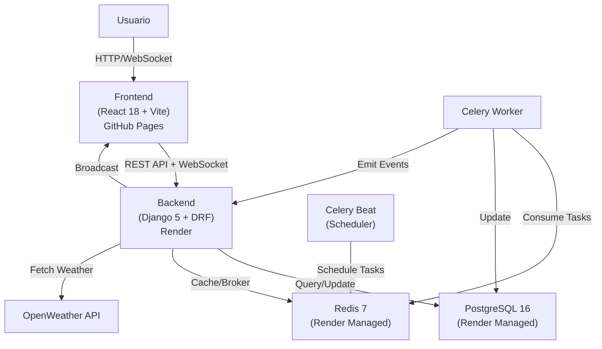
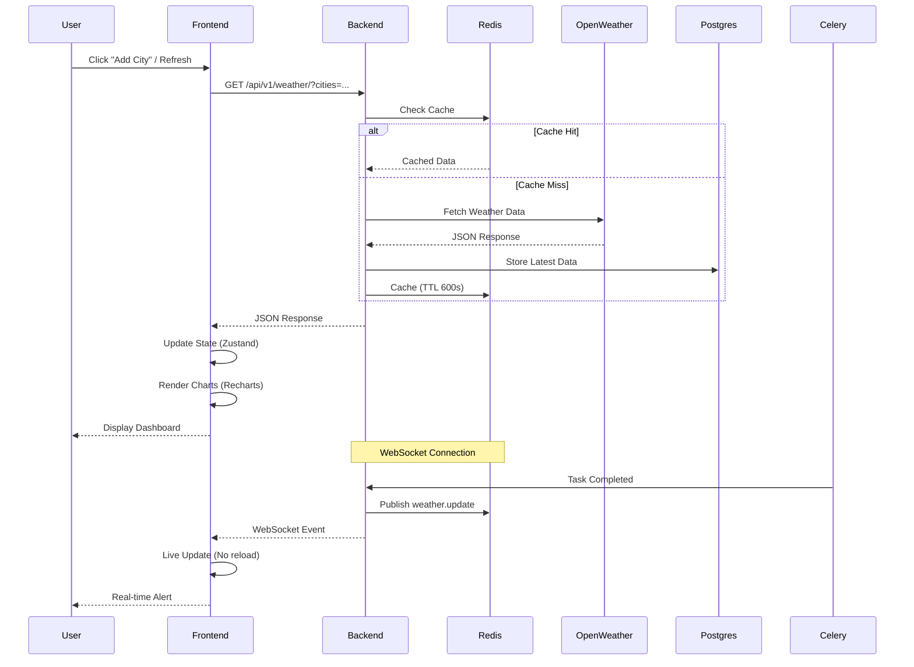
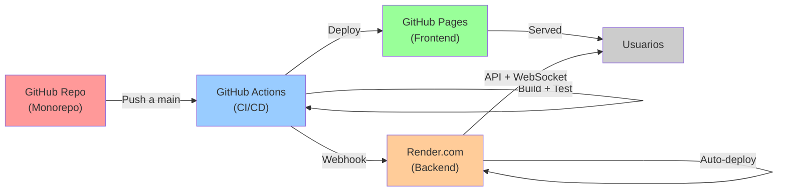

# Architecture Diagrams

## Diagrama de Componentes

Visualiza cómo los componentes principales del sistema interactúan entre sí:

## Diagrama de Secuencia

Muestra el flujo de una solicitud de clima desde el usuario hasta la visualización:

## Diagrama de Despliegue

Muestra cómo el código se propaga desde el repositorio hasta los usuarios:

